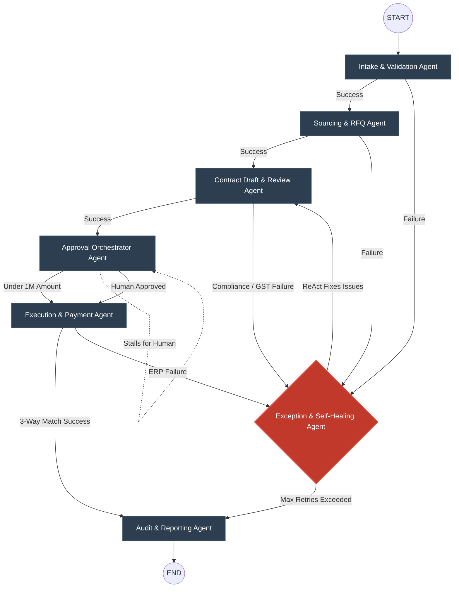

# 🏛 AvataarFlow Architecture

## 1. System Overview

AvataarFlow leverages **LangGraph** to model the Contract-to-Payment process as a stateful, cyclical graph. 

The workflow uses an asynchronous Event-Driven pattern where `GraphState` serves as the global single source of truth. As the state flows from one agent to another, each agent retrieves context, makes localized tool calls, updates the state, and records reasoning into an encrypted immutable AES-256 SQLite database.

## 2. Multi-Agent Flow Diagram

Below is the state-machine representation of our multi-agent orchestration. The `router` handles conditional edges, specifically rerouting to the **Exception/Self-Healing Agent** whenever issues are mapped (e.g. GST validation failures).

## 3. Specialized Agent Roles

1. **Intake & Validation Agent**: Parses unstructured PR PDFs via `pdfplumber`, structuring data via regex heuristics, and calls Mock ERP endpoints.
2. **Sourcing & RFQ Agent**: Emulates assignment capabilities based on internal PR logic mapping.
3. **Contract Draft & Review Agent**: Embeds hardcoded India-specific tax rules (GST validations, TDS section 194J matching).
4. **Approval Orchestrator Agent**: Contextual pause node. Halts execution if `amount > 1,000,000` until human UI interaction triggers a LangGraph state update.
5. **Execution & Payment Agent**: Conducts the crucial 3-way match (PR vs PO vs Invoice) asynchronously.
6. **Exception & Self-Healing Agent**: Utilizes a pseudo-ReAct reflection loop to analyze missing or corrupt variables (e.g., extracts PAN from a valid GSTIN string automatically without human intervention).
7. **Audit & Reporting Agent**: Finalizes workflow status, signs off logs, and enables secure unencrypted PDF payload generation for compliance reviews.
